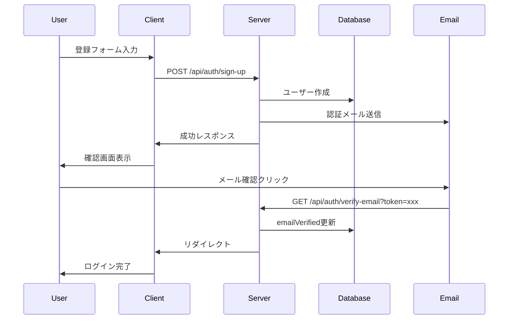
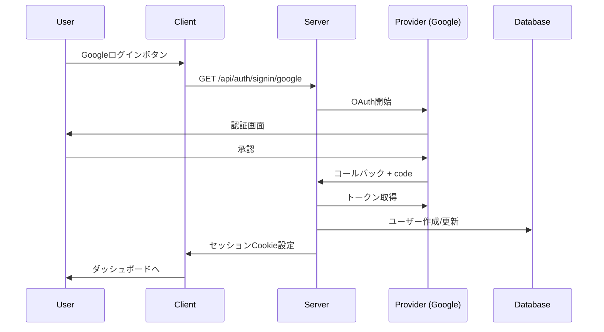

# Polyglot Vocab - 認証設計書

## 概要

Better Authを使用した認証システムの設計書です。セルフホスト型でフル機能の認証を実現します。

---

## Better Auth 選定理由

| 要件 | Better Auth | NextAuth | Clerk |
|------|------------|----------|-------|
| セルフホスト | ✅ | ✅ | ❌ |
| 無料 | ✅ | ✅ | 制限あり |
| TypeScript | ✅ ネイティブ | ✅ | ✅ |
| Prisma統合 | ✅ | ✅ | ❌ |
| ソーシャルログイン | ✅ | ✅ | ✅ |
| MFA | ✅ | プラグイン | ✅ |
| 組織/チーム | ✅ プラグイン | ❌ | ✅ |
| カスタマイズ性 | ✅ 高い | 中 | 低い |
| Hono対応 | ✅ | ❌ | ❌ |

---

## アーキテクチャ

```
┌─────────────────────────────────────────────────────────────┐
│                      クライアント                            │
├─────────────────────────────────────────────────────────────┤
│  ┌─────────────┐  ┌─────────────┐  ┌─────────────┐         │
│  │  Web App    │  │  iOS App    │  │ Android App │         │
│  │  (Next.js)  │  │  (Flutter)  │  │  (Flutter)  │         │
│  └──────┬──────┘  └──────┬──────┘  └──────┬──────┘         │
│         │                │                │                 │
│         └────────────────┼────────────────┘                 │
│                          ▼                                  │
│  ┌──────────────────────────────────────────────────────┐  │
│  │            Better Auth Client SDK                     │  │
│  │  • useSession() • signIn() • signOut()               │  │
│  └──────────────────────────────────────────────────────┘  │
└────────────────────────────┬────────────────────────────────┘
                             │ HTTPS
                             ▼
┌─────────────────────────────────────────────────────────────┐
│                      サーバー                               │
├─────────────────────────────────────────────────────────────┤
│  ┌──────────────────────────────────────────────────────┐  │
│  │              Next.js API Routes                       │  │
│  │              /api/auth/[...all]                       │  │
│  └──────────────────────────────────────────────────────┘  │
│                          │                                  │
│                          ▼                                  │
│  ┌──────────────────────────────────────────────────────┐  │
│  │              Better Auth Server                       │  │
│  │  ┌─────────────┐ ┌─────────────┐ ┌─────────────┐     │  │
│  │  │   Core      │ │  Plugins    │ │  Adapters   │     │  │
│  │  │             │ │             │ │             │     │  │
│  │  │ • Session   │ │ • OAuth     │ │ • Prisma    │     │  │
│  │  │ • JWT       │ │ • MFA       │ │             │     │  │
│  │  │ • Cookie    │ │ • Organization │             │     │  │
│  │  └─────────────┘ └─────────────┘ └──────┬──────┘     │  │
│  └──────────────────────────────────────────┼───────────┘  │
│                                             │               │
│                                             ▼               │
│  ┌──────────────────────────────────────────────────────┐  │
│  │                    PostgreSQL                         │  │
│  │  users, sessions, accounts, verifications, etc.       │  │
│  └──────────────────────────────────────────────────────┘  │
└─────────────────────────────────────────────────────────────┘
```

---

## データベーススキーマ

```prisma
// prisma/schema.prisma に追加

// ユーザー
model User {
  id            String    @id @default(cuid())
  name          String?
  email         String    @unique
  emailVerified DateTime?
  image         String?
  createdAt     DateTime  @default(now())
  updatedAt     DateTime  @updatedAt
  
  // Better Auth relations
  sessions      Session[]
  accounts      Account[]
  
  // App relations
  vocabularyWords VocabularyWord[]
  readingHistory  ReadingHistory[]
  
  // Subscription
  subscriptionTier String   @default("free") // free, pro, business
  subscriptionId   String?
  
  // Settings
  settings        UserSettings?
}

// セッション
model Session {
  id           String   @id @default(cuid())
  sessionToken String   @unique
  userId       String
  user         User     @relation(fields: [userId], references: [id], onDelete: Cascade)
  expiresAt    DateTime
  createdAt    DateTime @default(now())
  updatedAt    DateTime @updatedAt
  
  // Device info
  userAgent    String?
  ipAddress    String?
  
  @@index([userId])
}

// OAuth アカウント
model Account {
  id                String  @id @default(cuid())
  userId            String
  user              User    @relation(fields: [userId], references: [id], onDelete: Cascade)
  type              String
  provider          String
  providerAccountId String
  refresh_token     String?
  access_token      String?
  expires_at        Int?
  token_type        String?
  scope             String?
  id_token          String?
  session_state     String?
  
  createdAt         DateTime @default(now())
  updatedAt         DateTime @updatedAt
  
  @@unique([provider, providerAccountId])
  @@index([userId])
}

// メール認証トークン
model Verification {
  id         String   @id @default(cuid())
  identifier String
  value      String
  expiresAt  DateTime
  createdAt  DateTime @default(now())
  updatedAt  DateTime @updatedAt
  
  @@unique([identifier, value])
}

// ユーザー設定
model UserSettings {
  id                String   @id @default(cuid())
  userId            String   @unique
  user              User     @relation(fields: [userId], references: [id], onDelete: Cascade)
  
  // 言語設定
  nativeLanguage    String   @default("ja")
  learningLanguages String[] @default(["en"])
  
  // UI設定
  theme             String   @default("system")
  uiLanguage        String   @default("ja")
  
  // 学習設定
  dailyGoal         Int      @default(10)
  notificationsEnabled Boolean @default(true)
  
  // プライバシー
  profilePublic     Boolean  @default(false)
  showProgress      Boolean  @default(true)
  
  createdAt         DateTime @default(now())
  updatedAt         DateTime @updatedAt
}
```

---

## 実装

### 1. パッケージインストール

```bash
pnpm add better-auth @better-auth/prisma-adapter
```

### 2. Better Auth サーバー設定

```typescript
// src/lib/auth.ts
import { betterAuth } from "better-auth";
import { prismaAdapter } from "@better-auth/prisma-adapter";
import { prisma } from "./prisma";

export const auth = betterAuth({
  database: prismaAdapter(prisma, {
    provider: "postgresql",
  }),
  
  // セッション設定
  session: {
    expiresIn: 60 * 60 * 24 * 7, // 7日
    updateAge: 60 * 60 * 24,     // 1日ごとに更新
    cookieCache: {
      enabled: true,
      maxAge: 60 * 5, // 5分キャッシュ
    },
  },
  
  // ユーザー設定
  user: {
    additionalFields: {
      subscriptionTier: {
        type: "string",
        required: false,
        defaultValue: "free",
      },
    },
  },
  
  // メール設定
  emailAndPassword: {
    enabled: true,
    requireEmailVerification: true,
    sendResetPassword: async ({ user, url }) => {
      // メール送信処理
      await sendEmail({
        to: user.email,
        subject: "パスワードリセット",
        html: `<a href="${url}">こちらをクリックしてパスワードをリセット</a>`,
      });
    },
  },
  
  // ソーシャルログイン
  socialProviders: {
    google: {
      clientId: process.env.GOOGLE_CLIENT_ID!,
      clientSecret: process.env.GOOGLE_CLIENT_SECRET!,
    },
    apple: {
      clientId: process.env.APPLE_CLIENT_ID!,
      clientSecret: process.env.APPLE_CLIENT_SECRET!,
    },
    github: {
      clientId: process.env.GITHUB_CLIENT_ID!,
      clientSecret: process.env.GITHUB_CLIENT_SECRET!,
    },
  },
  
  // プラグイン
  plugins: [
    // MFA
    twoFactor({
      issuer: "Polyglot Vocab",
    }),
    
    // 組織（企業向け）
    organization({
      allowUserToCreateOrganization: false,
    }),
  ],
  
  // コールバック
  callbacks: {
    // セッション作成時
    session: async ({ session, user }) => {
      return {
        ...session,
        user: {
          ...session.user,
          subscriptionTier: user.subscriptionTier,
        },
      };
    },
    
    // ユーザー作成時
    onUserCreate: async ({ user }) => {
      // デフォルト設定作成
      await prisma.userSettings.create({
        data: { userId: user.id },
      });
      
      // Welcome email
      await sendWelcomeEmail(user.email);
    },
  },
});

export type Session = typeof auth.$Infer.Session;
```

### 3. API Routes

```typescript
// src/app/api/auth/[...all]/route.ts
import { auth } from "@/lib/auth";
import { toNextJsHandler } from "better-auth/next-js";

export const { GET, POST } = toNextJsHandler(auth.handler);
```

### 4. クライアントSDK

```typescript
// src/lib/auth-client.ts
import { createAuthClient } from "better-auth/react";

export const authClient = createAuthClient({
  baseURL: process.env.NEXT_PUBLIC_APP_URL,
});

export const {
  useSession,
  signIn,
  signOut,
  signUp,
} = authClient;
```

### 5. 認証コンポーネント

```tsx
// src/components/auth/SignInForm.tsx
"use client";

import { useState } from "react";
import { signIn } from "@/lib/auth-client";
import { Button } from "@/components/ui/button";
import { Input } from "@/components/ui/input";

export function SignInForm() {
  const [email, setEmail] = useState("");
  const [password, setPassword] = useState("");
  const [loading, setLoading] = useState(false);
  const [error, setError] = useState<string | null>(null);

  const handleEmailSignIn = async (e: React.FormEvent) => {
    e.preventDefault();
    setLoading(true);
    setError(null);

    try {
      await signIn.email({
        email,
        password,
        callbackURL: "/",
      });
    } catch (err) {
      setError("ログインに失敗しました");
    } finally {
      setLoading(false);
    }
  };

  const handleSocialSignIn = async (provider: "google" | "apple" | "github") => {
    await signIn.social({
      provider,
      callbackURL: "/",
    });
  };

  return (
    <div className="w-full max-w-md space-y-6">
      <form onSubmit={handleEmailSignIn} className="space-y-4">
        <Input
          type="email"
          placeholder="メールアドレス"
          value={email}
          onChange={(e) => setEmail(e.target.value)}
          required
        />
        <Input
          type="password"
          placeholder="パスワード"
          value={password}
          onChange={(e) => setPassword(e.target.value)}
          required
        />
        {error && <p className="text-red-500 text-sm">{error}</p>}
        <Button type="submit" className="w-full" disabled={loading}>
          {loading ? "ログイン中..." : "ログイン"}
        </Button>
      </form>

      <div className="relative">
        <div className="absolute inset-0 flex items-center">
          <span className="w-full border-t" />
        </div>
        <div className="relative flex justify-center text-xs uppercase">
          <span className="bg-background px-2 text-muted-foreground">または</span>
        </div>
      </div>

      <div className="space-y-2">
        <Button
          variant="outline"
          className="w-full"
          onClick={() => handleSocialSignIn("google")}
        >
          <GoogleIcon className="mr-2 h-4 w-4" />
          Googleでログイン
        </Button>
        <Button
          variant="outline"
          className="w-full"
          onClick={() => handleSocialSignIn("apple")}
        >
          <AppleIcon className="mr-2 h-4 w-4" />
          Appleでログイン
        </Button>
      </div>
    </div>
  );
}
```

### 6. 認証ミドルウェア

```typescript
// src/middleware.ts
import { auth } from "@/lib/auth";
import { NextResponse } from "next/server";
import type { NextRequest } from "next/server";

export async function middleware(request: NextRequest) {
  const session = await auth.api.getSession({
    headers: request.headers,
  });

  // 認証が必要なルート
  const protectedRoutes = ["/dashboard", "/settings", "/api/words"];
  const isProtectedRoute = protectedRoutes.some((route) =>
    request.nextUrl.pathname.startsWith(route)
  );

  if (isProtectedRoute && !session) {
    return NextResponse.redirect(new URL("/auth/signin", request.url));
  }

  // Pro機能へのアクセス制限
  const proRoutes = ["/api/ai", "/api/export"];
  const isProRoute = proRoutes.some((route) =>
    request.nextUrl.pathname.startsWith(route)
  );

  if (isProRoute && session?.user.subscriptionTier === "free") {
    return NextResponse.json(
      { error: "Pro subscription required" },
      { status: 403 }
    );
  }

  return NextResponse.next();
}

export const config = {
  matcher: [
    "/dashboard/:path*",
    "/settings/:path*",
    "/api/:path*",
  ],
};
```

---

## 認証フロー

### メール/パスワード登録



### ソーシャルログイン



---

## セキュリティ考慮事項

### 1. セッション管理

```typescript
// セッション設定
session: {
  expiresIn: 60 * 60 * 24 * 7,  // 7日で期限切れ
  updateAge: 60 * 60 * 24,      // 1日ごとにリフレッシュ
  cookieCache: {
    enabled: true,
    maxAge: 60 * 5,             // 5分キャッシュ
  },
}
```

### 2. CSRF対策

Better Authは自動でCSRFトークンを処理します。

### 3. レート制限

```typescript
// Upstash Redis でレート制限
import { Ratelimit } from "@upstash/ratelimit";
import { Redis } from "@upstash/redis";

const ratelimit = new Ratelimit({
  redis: Redis.fromEnv(),
  limiter: Ratelimit.slidingWindow(10, "1 m"), // 1分に10リクエスト
});

// 認証エンドポイントに適用
```

### 4. パスワードポリシー

```typescript
emailAndPassword: {
  enabled: true,
  minPasswordLength: 8,
  passwordValidation: (password) => {
    // 強度チェック
    const hasUpperCase = /[A-Z]/.test(password);
    const hasLowerCase = /[a-z]/.test(password);
    const hasNumber = /\d/.test(password);
    
    if (!hasUpperCase || !hasLowerCase || !hasNumber) {
      throw new Error("パスワードは大文字、小文字、数字を含む必要があります");
    }
  },
}
```

---

## 環境変数

```env
# .env

# Better Auth
BETTER_AUTH_SECRET=your-secret-key-here  # openssl rand -base64 32

# OAuth Providers
GOOGLE_CLIENT_ID=xxx
GOOGLE_CLIENT_SECRET=xxx

APPLE_CLIENT_ID=xxx
APPLE_CLIENT_SECRET=xxx

GITHUB_CLIENT_ID=xxx
GITHUB_CLIENT_SECRET=xxx

# Email (Resend)
RESEND_API_KEY=xxx

# Database
DATABASE_URL=postgresql://...
```

---

## テスト

```typescript
// tests/auth.test.ts
import { describe, it, expect } from "vitest";
import { auth } from "@/lib/auth";

describe("認証", () => {
  it("メール/パスワードでサインアップできる", async () => {
    const result = await auth.api.signUpEmail({
      body: {
        email: "test@example.com",
        password: "Test1234!",
        name: "Test User",
      },
    });
    
    expect(result.user).toBeDefined();
    expect(result.user.email).toBe("test@example.com");
  });
  
  it("ログインでセッションが作成される", async () => {
    const result = await auth.api.signInEmail({
      body: {
        email: "test@example.com",
        password: "Test1234!",
      },
    });
    
    expect(result.session).toBeDefined();
  });
});
```

---

*最終更新: 2024年12月27日*

